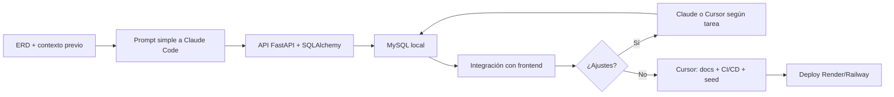
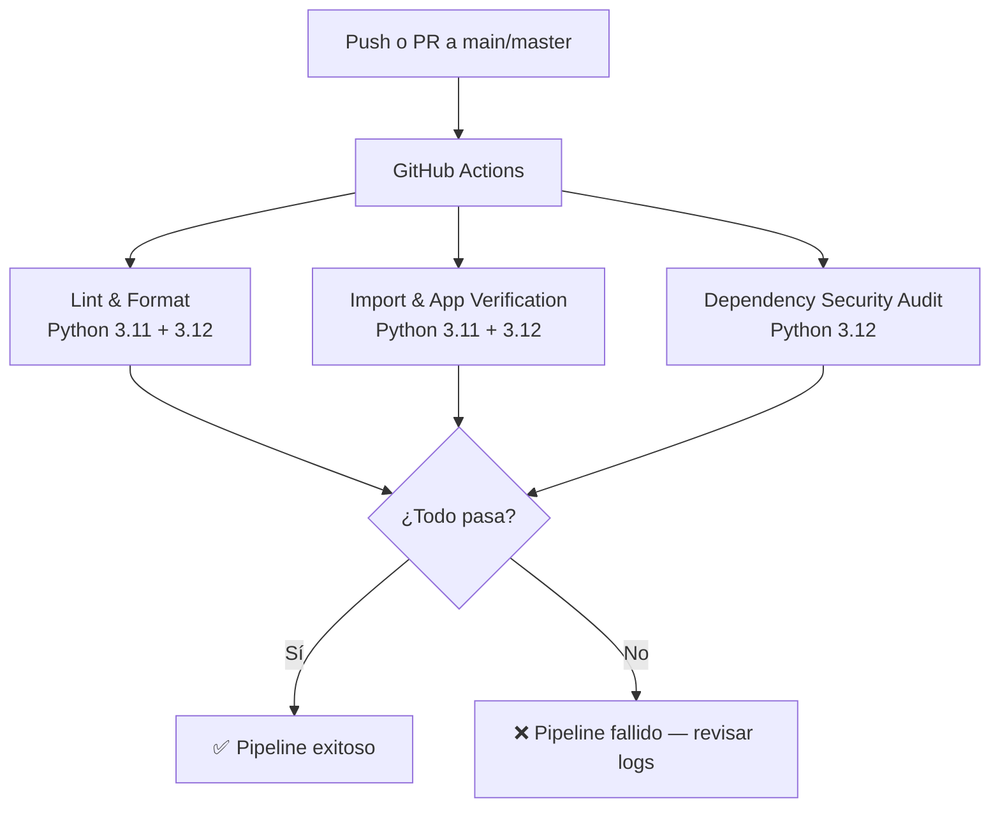

# Informe Técnico — Backend (Bitácora de Desarrollo con IA)

**Proyecto:** Jill's Sandwich — API Backend  
**Asignatura:** Gestión de Desarrollo de Software — TP Integrador  
**Fecha:** Junio 2026

---

## 1. Resumen del backend

Desarrollamos la capa de servicios del sistema **Jill's Sandwich**: una API REST en **FastAPI** que persiste datos en **MySQL** mediante **SQLAlchemy** y expone endpoints para autenticación, pedidos, clientes, menú, mesas y ventas.

El backend fue diseñado para consumirse desde un panel de administración (React) y soporta un modelo de seguridad con **dos tokens JWT**: uno de acceso general y otro específico para operaciones de ventas.

### Alcance de este informe

Nos centramos en el **backend y la base de datos**. No profundizamos en el proyecto base del cual se desprende el TP (automatización con n8n, WhatsApp, etc.), salvo donde impacta directamente en las entidades del dominio (por ejemplo, clientes identificados por teléfono o mesas con token QR).

### Repositorios y demo

- **Frontend:** [ProyectoDeGestionDeRestaurante-Front](https://github.com/EmiG4rcia/ProyectoDeGestionDeRestaurante-Front)
- **Backend:** [ProyectoDeGestionDeRestaurante-Back](https://github.com/EmiG4rcia/ProyectoDeGestionDeRestaurante-Back)
- **API desplegada:** [PENDIENTE — URL Render/Railway]
- **Swagger:** `{API_URL}/docs`
- **Video demo:** [Primera presentación en YouTube](https://youtu.be/fP-bVC3v1AU)

---

## 2. Modelo de datos

### Entidades principales


| Tabla         | Rol                                                      |
| ------------- | -------------------------------------------------------- |
| `admin_users` | Administradores del panel (login + contraseña de ventas) |
| `customers`   | Clientes del restaurante                                 |
| `tables`      | Mesas con estado (`available` / `occupied`) y `qr_token` |
| `menu_items`  | Platos con precio, categoría y disponibilidad            |
| `orders`      | Pedidos con flujo de estados                             |
| `order_items` | Ítems de cada pedido                                     |
| `payments`    | Pagos vinculados a pedidos                               |


### Relaciones clave

- Un **cliente** puede tener muchos **pedidos**.
- Una **mesa** puede tener muchos **pedidos**.
- Un **pedido** contiene muchos **order_items**, cada uno referenciando un **menu_item**.
- Un **pago** pertenece a un **pedido**.

### Diagrama ERD

Diagrama ERD del sistema

> **Nota:** Guardar la captura del ERD en `docs/erd.png` antes de subir el repo (puede compartirse con el frontend).

---

## 3. Arquitectura del backend

### Organización por features

Adoptamos una estructura modular donde cada dominio tiene su propio paquete:

```
features/
├── auth/       → JWT, login, verificación de ventas
├── customers/  → CRUD de clientes
├── menu/       → CRUD del menú
├── orders/     → Pedidos y estados
├── sales/      → Pagos y resumen de ventas
└── tables/     → Mesas y generación de QR
```

Cada feature contiene:

- `models.py` — Entidades SQLAlchemy
- `schemas.py` — Validación Pydantic (request/response)
- `service.py` — Lógica de negocio
- `router.py` — Endpoints FastAPI

La capa `core/` centraliza configuración (`.env`), conexión a base de datos, seguridad JWT y dependencias de autenticación.

### Autenticación dual


| Token          | Tipo JWT       | Duración | Uso                                      |
| -------------- | -------------- | -------- | ---------------------------------------- |
| `access_token` | `type: access` | 480 min  | Lectura, menú, mesas, cambio de estados  |
| `sales_token`  | `type: sales`  | 15 min   | Crear/eliminar pedidos, clientes y pagos |


Esta separación nos permitió implementar una **doble verificación** para operaciones sensibles sin complicar el login diario del administrador.

---

## 4. Nuestro arsenal de herramientas de IA


| Herramienta                 | Versión / Plan | Uso principal en el backend                                                                                        |
| --------------------------- | -------------- | ------------------------------------------------------------------------------------------------------------------ |
| **Claude Code** (navegador) | Pro            | Generación del código backend: modelos SQLAlchemy, routers, servicios, autenticación JWT y estructura por features |
| **Cursor**                  | Agent mode     | Documentación, depuración rápida, modificación de código, CI/CD, script de seed y preparación para despliegue      |


---

## 5. Sinergia con la IA — Cómo nos ayudó a programar el backend

### 5.1 Generación de código (Claude Code)

Para generar el código del backend utilizamos **Claude Code en su versión de navegador**, mientras que reservamos **Cursor** para documentación, depuración y corrección rápida de problemas en el proyecto.

El desarrollo del backend fue impulsado principalmente por Claude, aprovechando el **contexto previo del dominio del restaurante** que ya estaba cargado en la conversación. Por eso, el prompt inicial fue **intencionalmente simple**:

**Prompt inicial (reconstruido):**

```
Necesitamos la API REST en FastAPI para el panel de administración del restaurante.
Debe cubrir autenticación, pedidos, clientes, menú, mesas y ventas,
usando SQLAlchemy con MySQL y JWT para proteger los endpoints.
```

**Tareas donde la IA fue más útil en el backend:**

- Estructura por features (`auth`, `orders`, `customers`, etc.)
- Modelos SQLAlchemy alineados con el ERD
- Schemas Pydantic para validación de entrada/salida
- Servicios con lógica de negocio (filtros, estados, totales)
- Routers REST con inyección de dependencias
- Autenticación JWT con dos niveles (`access` + `sales`)
- Hash de contraseñas con bcrypt/passlib
- Generación de QR para mesas

Los prompts que **mejor funcionaron** con Claude fueron los orientados a la **generación de la estructura del proyecto**: Claude demostró ser muy eficiente a la hora de diagramar clases, archivos y cómo estos deberían estar conectados entre sí.

### 5.2 Depuración y ajustes

El backend **funcionó desde el principio sin errores**. No tuvimos que corregir bugs en el código generado por Claude; el flujo consistió en probar la API y, cuando fue necesario, pedir ajustes puntuales.

Para depuración y correcciones rápidas durante el desarrollo y la entrega del TP, utilizamos **Cursor** por su integración con el IDE, acceso al terminal y capacidad de leer el proyecto completo.

**Estimación de tiempo:**


| Enfoque         | Tiempo estimado  |
| --------------- | ---------------- |
| Con Claude Code | Menos de 2 horas |
| Manual (sin IA) | Al menos 5 horas |


### 5.3 Documentación y entrega (Cursor)

Cursor intervino en la fase de **empaquetado del TP** para el backend:

- README completo del backend
- Informe técnico (este documento)
- `requirements.txt` con dependencias pinneadas
- `.env.example` y `.gitignore`
- Script `scripts/seed_admin.py` para crear el primer administrador
- Pipeline CI en GitHub Actions (lint, smoke test y auditoría de seguridad)
- Planificación de las etapas de armado y entrega según consignas del TP
- Despliegue en Render/Railway — pendiente
- Documentación unificada front + back — en progreso

---

## 6. Lecciones aprendidas y desafíos

### 6.1 Lo que funcionó bien

- **Contexto previo en la conversación:** Tener el dominio del restaurante y el ERD ya cargados en Claude Code nos permitió un prompt inicial minimalista pero efectivo.
- **Eficiencia en estructura de proyecto:** Claude destacó en diagramar la arquitectura por features, las relaciones entre módulos y la organización de archivos.
- **Código funcional a la primera:** El backend corrió sin errores desde la primera iteración, lo que nos ahorró tiempo de depuración.
- **Arquitectura por features:** La separación en módulos independientes facilitó entender, extender y documentar cada dominio.
- **Consistencia con el frontend:** Al compartir contratos de API y entidades, redujimos fricción en la integración con el panel React.
- **Velocidad:** Generamos el backend en **menos de 2 horas** con IA, frente a una estimación de **al menos 5 horas** de forma manual.

### 6.2 Donde la IA requirió intervención manual

- **Credenciales iniciales:** La función `create_first_admin` existía en el código pero no estaba expuesta por API ni documentada; resolvimos esto con un script de seed creado con Cursor.
- **Preparación para producción:** Faltaban `requirements.txt`, `.gitignore`, pipeline CI y guía de despliegue — resueltas progresivamente (ver sección 9 para el detalle del CI).
- **Base de datos:** La conexión MySQL, creación de tablas y variables de entorno requieren configuración manual fuera del alcance del chat.
- **CORS en despliegue:** Hay que actualizar `allow_origins` en `main.py` con la URL real del frontend.

### 6.3 Desafíos técnicos específicos del backend

- **Autenticación dual:** Diseñar dos tokens JWT con distintos scopes y tiempos de expiración.
- **Operaciones con distinto nivel de acceso:** Algunos endpoints usan `get_current_admin` y otros `get_sales_access` dentro del mismo router.
- **Integridad referencial:** Pedidos vinculados a clientes, mesas e ítems del menú con totales calculados en servicio.
- **Despliegue con MySQL externo:** Configurar `DATABASE_URL` en la nube y mantener la base sincronizada con los modelos.

### 6.4 Reflexión sobre la eficiencia de la IA

Para un backend de esta escala (CRUD + auth + lógica de negocio moderada), Claude Code demostró ser **altamente eficiente** cuando:

1. El ERD y los flujos de negocio estaban claros antes de generar código
2. Confiamos en la IA para completar detalles no explicitados (schemas, enums, filtros)
3. Reservamos Cursor para depuración, documentación y empaquetado profesional

La clave fue **no sobre-explicar el prompt** cuando el contexto ya estaba cargado, y confiar en la capacidad de Claude para diagramar la estructura del proyecto de forma coherente.

---

## 7. Flujo de trabajo adoptado (backend)




---

## 8. Experiencia con Cursor (documentación y organización)

### 8.1 Tareas realizadas con Cursor en el backend

- README del backend
- Informe técnico backend
- `requirements.txt`, `.env.example`, `.gitignore`
- Script de seed para administrador
- GitHub Actions (CI)
- Planificación de etapas de entrega del TP
- Despliegue y CORS para producción

### 8.2 ¿Qué tan útil fue Cursor vs Claude para el backend?

Cursor resultó **extremadamente útil** para generar y modificar documentación. Gracias a su capacidad de analizar y leer el proyecto al ser un agente integrado en el IDE, se convirtió en la mejor opción para documentar, modificar código de forma rápida y depurar mediante acceso al terminal para ejecutar comandos.

No identificamos una herramienta como estrictamente "mejor" que la otra; definimos con claridad en qué contextos preferimos usar cada una:


| Herramienta                 | Contexto preferido                           | Por qué                                                                                           |
| --------------------------- | -------------------------------------------- | ------------------------------------------------------------------------------------------------- |
| **Claude Code** (navegador) | Generar código desde cero                    | Es nuestro puntapié inicial. Destaca en diagramar estructura, clases y conexiones entre archivos. |
| **Cursor** (agente en IDE)  | Documentación, depuración y tareas mecánicas | Integrado en el editor: lee archivos, ejecuta terminal y modifica código sin salir del entorno.   |


**Ventajas concretas de Cursor que destacamos:**

- **Documentación con contexto completo:** Lee todo el proyecto y genera README e informes técnicos alineados con el código real.
- **Modificaciones iterativas sin fricción:** Cada vez que necesitamos ajustar la documentación, Cursor lo hizo sin repetir instrucciones ni sobre-explicar.
- **Depuración rápida:** Acceso directo al terminal para ejecutar comandos, verificar imports y probar scripts.
- **Comprensión de código ajeno:** Cursor también resulta muy útil para entender proyectos con código que no es propio.

En resumen: **Claude Code construye, Cursor mantiene, documenta y empaqueta.**

### 8.3 Prompts que funcionaron mejor en Cursor

Los prompts orientados a **crear documentación** y a **ir modificándola según lo que necesitábamos** en cada iteración fueron los más productivos. Pedirle a Cursor que explore el proyecto, arme README e informe técnico, y luego refinar el contenido con correcciones puntuales resultó mucho más eficiente que redactar toda la documentación manualmente.

---

## 9. Pipeline CI del Backend

Configuramos un pipeline de **Integración Continua (CI)** con GitHub Actions para validar automáticamente cada cambio antes de integrarlo a `main`. El diseño e implementación del pipeline fueron desarrollados por un integrante del equipo; documentamos aquí su arquitectura, decisiones y problemas resueltos.

### 9.1 Arquitectura del pipeline

El pipeline se define en `.github/workflows/ci.yml` y consta de **tres jobs independientes** que se ejecutan en **paralelo**:

```
push / PR a main o master
         │
    ┌────┼────┐
    ▼    ▼    ▼
  Lint  Import  Security
  &     Check   Audit
 Format  & App
         Verify
```

Si **cualquiera** de los jobs falla, el pipeline completo se marca como fallido.

#### Eventos de disparo

```yaml
on:
  push:
    branches: [main, master]
  pull_request:
    branches: [main, master]
```


| Escenario                            | Qué valida                                                                                      |
| ------------------------------------ | ----------------------------------------------------------------------------------------------- |
| Push directo a `main` / `master`     | Que el código integrado sea correcto                                                            |
| Pull Request hacia `main` / `master` | Que el código sea correcto **antes** de integrarse, detectando problemas en la fase de revisión |


### 9.2 Descripción de los jobs

#### Job 1: Lint & Format

**Propósito:** Verificar que el código cumple estándares de estilo y no contiene errores estáticos detectables por análisis de código.

**Herramienta:** [Ruff](https://docs.astral.sh/ruff/) — linter y formateador de Python escrito en Rust, compatible con reglas de Flake8, isort y Black.

**Estrategia:** Matrix con Python **3.11** y **3.12** (dos ejecuciones en paralelo).

**Pasos:**

1. Checkout del código fuente
2. Configuración de Python según la versión del matrix
3. Instalación de dependencias del proyecto + Ruff
4. `ruff check .` — análisis estático (imports no usados, variables redefinidas, violaciones PEP 8, etc.)
5. `ruff format --check .` — verifica formato consistente sin modificar archivos (solo lectura)

**Configuración personalizada (`ruff.toml`):**

```toml
[lint.per-file-ignores]
"main.py" = ["F401"]
"setup_db.py" = ["F401"]
```

Suprimimos la regla **F401** (import no usado) en `main.py` y `setup_db.py` porque SQLAlchemy requiere importar los modelos como efecto secundario para registrarlos en `Base.metadata`, aunque no se referencien explícitamente en el código.

#### Job 2: Import & App Verification

**Propósito:** Smoke test que verifica que la aplicación FastAPI puede inicializarse: imports no rotos, modelos bien definidos y configuración válida.

**Estrategia:** Matrix con Python **3.11** y **3.12**.

**Pasos:**

1. Checkout del código fuente
2. Configuración de Python
3. Instalación de dependencias
4. Ejecución del smoke test:

```python
from main import app
print('App loaded:', app.title, 'v' + app.version)
```

**Variables de entorno simuladas:**


| Variable       | Valor en CI                             | Propósito                               |
| -------------- | --------------------------------------- | --------------------------------------- |
| `DATABASE_URL` | `sqlite:///test.db`                     | Evita depender de MySQL real durante CI |
| `SECRET_KEY`   | `ci-test-secret-key-not-for-production` | Placeholder para firma JWT              |


Usamos SQLite en lugar de MySQL porque el smoke test solo verifica que la app **levante**, no que ejecute queries reales. Esto mantiene el pipeline rápido y sin dependencias externas, gracias a la abstracción del engine en SQLAlchemy.

#### Job 3: Dependency Security Audit

**Propósito:** Detectar vulnerabilidades conocidas (CVEs) en las dependencias del proyecto.

**Herramienta:** [pip-audit](https://pypi.org/project/pip-audit/) — escanea paquetes instalados contra bases públicas (PyPI Advisory Database, OSV).

**Estrategia:** Solo Python **3.12** (sin matrix), ya que las dependencias son idénticas sin importar la versión de Python.

**Pasos:**

1. Checkout del código fuente
2. Configuración de Python 3.12
3. Instalación de dependencias + pip-audit
4. `pip-audit` — escaneo de todas las dependencias instaladas

Si se detecta una vulnerabilidad, el job falla y el equipo es notificado antes de integrar el cambio.

### 9.3 Decisiones de diseño

#### Paralelismo entre jobs

Los tres jobs no tienen dependencias entre sí y corren en paralelo. El tiempo total del pipeline equivale al del job más lento, no a la suma de todos.

#### Matrix de versiones de Python


| Job                       | Matrix      | Motivo                                                                     |
| ------------------------- | ----------- | -------------------------------------------------------------------------- |
| Lint & Format             | 3.11 + 3.12 | Garantizar compatibilidad entre versiones usadas por distintos integrantes |
| Import & App Verification | 3.11 + 3.12 | Idem                                                                       |
| Security Audit            | Solo 3.12   | Audita paquetes de terceros, no el código propio del proyecto              |


#### Smoke test con SQLite

Evitamos levantar un contenedor MySQL en CI. El objetivo es verificar el arranque de la aplicación; SQLAlchemy permite cambiar el engine sin modificar el código de negocio.

#### Separación de responsabilidades


| Job                       | Pregunta que responde                                |
| ------------------------- | ---------------------------------------------------- |
| Lint & Format             | ¿El código cumple con los estándares de estilo?      |
| Import & App Verification | ¿La aplicación puede inicializarse sin errores?      |
| Dependency Security Audit | ¿Las dependencias tienen vulnerabilidades conocidas? |


Esta separación nos permite identificar rápidamente **qué tipo de problema** ocurrió cuando el pipeline falla.

### 9.4 Problemas encontrados y soluciones aplicadas

#### Imports aparentemente no utilizados

**Problema:** Ruff reportó 26 errores, incluyendo imports marcados como no usados en `main.py` y `setup_db.py`.

**Causa raíz:** SQLAlchemy requiere importar modelos para registrarlos en `Base.metadata`. Son imports necesarios por efecto secundario que Ruff no detecta automáticamente.

**Solución:** Configuramos `ruff.toml` con `per-file-ignores` para suprimir F401 solo en esos archivos, manteniendo la regla activa en el resto del proyecto.

#### Errores de lint en el código existente

**Problema:** El código generado inicialmente contenía imports duplicados y no usados en varios routers y servicios.

**Solución:**

- Corregimos los 26 errores de lint detectados por Ruff
- Reformateamos 31 archivos `.py` con `ruff format`
- Separamos en **2 commits**: uno para la configuración de CI y otro para las correcciones de estilo, manteniendo el historial limpio

### 9.5 Herramientas del pipeline


| Herramienta          | Versión             | Rol en el pipeline                      |
| -------------------- | ------------------- | --------------------------------------- |
| GitHub Actions       | v2 (hosted runners) | Plataforma de ejecución                 |
| actions/checkout     | v4                  | Clonado del repositorio                 |
| actions/setup-python | v5                  | Instalación de Python en el runner      |
| Ruff                 | Latest disponible   | Linter y verificador de formato         |
| pip-audit            | Latest disponible   | Auditoría de seguridad de dependencias  |
| SQLite               | Incluido en Python  | Base de datos temporal para smoke tests |


### 9.6 Flujo visual del pipeline




> **Nota sobre CD:** El pipeline actual cubre **Integración Continua (CI)** — validación automática de código. El **Despliegue Continuo (CD)** hacia Render/Railway permanece como paso manual pendiente.

---

## 10. Checklist de entrega (backend)


| #   | Requisito                            | Estado                      |
| --- | ------------------------------------ | --------------------------- |
| 1   | Repo público en GitHub               | ✅                           |
| 2   | Pipeline CI (GitHub Actions)         | ✅ Configurado y documentado |
| 2b  | Pipeline CD (deploy automático)      | ⬜ Pendiente                 |
| 3   | Informe de herramientas de IA        | ✅ Redactado                 |
| 4   | API desplegada y accesible           | ⬜ Pendiente deploy          |
| 5   | README de calidad                    | ✅ Creado                    |
| 6   | Swagger funcional en `/docs`         | ✅ Incluido en FastAPI       |
| 7   | Script de seed de admin              | ✅ Creado                    |
| 8   | Documentación unificada front + back | ⬜ En progreso               |


---

## 11. Conclusión

El backend de **Jill's Sandwich** demuestra cómo la IA puede acelerar la construcción de una API REST completa — con autenticación, persistencia relacional y lógica de negocio — sin sacrificar una arquitectura clara por features.

Generamos el backend en **menos de 2 horas** con Claude Code (frente a **al menos 5 horas** manualmente), y el código funcionó **desde la primera iteración sin errores**. La clave fue tener el contexto del dominio y el ERD cargados antes de pedir código, y confiar en la capacidad de Claude para diagramar la estructura del proyecto.

Cursor complementó el proceso en la fase de **empaquetado profesional**: documentación, dependencias, scripts operativos y planificación de la entrega del TP. El pipeline de CI — con lint, smoke test y auditoría de seguridad — fue diseñado e implementado por el equipo y quedó documentado en la sección 9 de este informe.

La IA no reemplaza el criterio del equipo, pero nos permitió enfocarnos en decisiones de arquitectura (como la autenticación dual) mientras delegábamos la implementación repetitiva de CRUDs, schemas y routers.